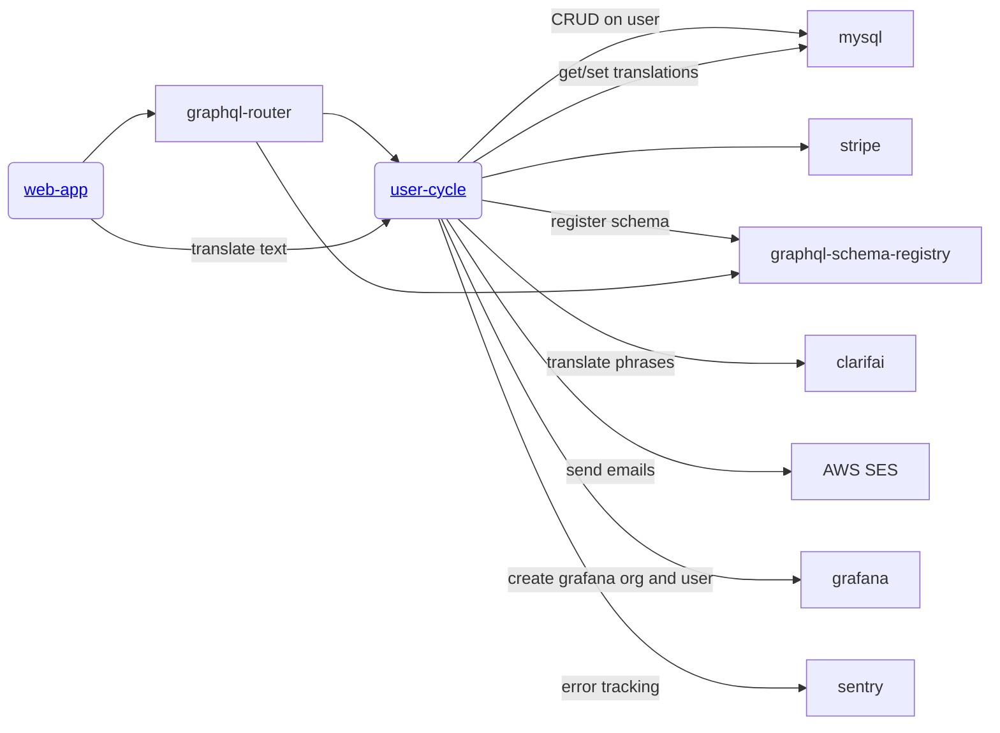

# user-cycle

A comprehensive user management microservice for the [Gratheon](https://gratheon.com) beekeeping platform. This service handles authentication, billing, API tokens, and internationalization within a federated GraphQL architecture.

## Key Features

- **Authentication & Authorization**
  - Email/password registration with proof-of-work anti-spam
  - Google OAuth 2.0 integration
  - JWT session management
  - API token generation for programmatic access
  - Share tokens for guest access to resources
  
- **Billing & Subscriptions**
  - Stripe integration (subscriptions, checkout, webhooks)
  - Multiple billing plans (free trial, starter, professional, enterprise)
  - Invoice management and billing history
  - Subscription lifecycle management
  
- **Internationalization (i18n)**
  - 13 language support (en, ru, et, tr, pl, de, fr, zh, hi, es, ar, bn, pt, ja)
  - Dual translation system (legacy + modern key-based)
  - AI-powered translations via Clarifai LLM
  - Plural form support with language-specific rules
  
- **User Management**
  - Profile management
  - Account deletion
  - Email notifications via AWS SES
  - Grafana provisioning per user

## Technology Stack

**Core Technologies**
- **Runtime**: Node.js 22+ with TypeScript 5.2
- **Web Framework**: Fastify 3.29
- **GraphQL**: Apollo Server 3.13 with Federation support
- **Database**: MySQL with `@databases/mysql` query builder
- **Testing**: Jest 29 with ts-jest

**External Integrations**
- **Payment Processing**: Stripe
- **Email**: AWS SES (Simple Email Service)
- **AI Translations**: Clarifai (GPT model via gRPC)
- **Monitoring**: Sentry (error tracking), Grafana (user provisioning)
- **Schema Registry**: GraphQL Federation schema registration

## Database Architecture

**Database**: MySQL 8.0+ with custom migration system

**Migration System**
- SHA-256 hash-based tracking in `_db_migrations` table
- 24 SQL migrations in `/migrations/` directory
- Automatic migration execution on startup

**Key Tables** (10 core tables)
- `account` - User accounts with billing and subscription data
- `api_tokens` - UUID-based API authentication tokens
- `share_tokens` - Scoped guest access tokens with JSON permissions
- `stripe_events` - Stripe webhook event log (JSON storage)
- `billing_history` - Complete billing audit trail
- `locales` - Legacy translation system (7 languages)
- `translations` - Modern key-based translation system
- `translation_values` - Translation values per language (13 languages)
- `plural_forms` - Language-specific plural forms (one/few/many/other)
- `plural_rules` - Grammatical plural rules per language

**Connection Details**
- Development: `mysql:3306` (Docker service)
- Production: DigitalOcean Managed MySQL
- Connection pool: 3 max connections
- Auto-reconnect with 10s interval
- Query performance logging

## GraphQL API

**Architecture**: Apollo Federation Subgraph
- Schema file: `/schema.graphql` (193 lines)
- Auto-registration with `gql-schema-registry` service
- Apollo Playground enabled for development

**Authentication**
- Context-based via `internal-userid` header
- JWT session tokens with shared secret
- Cookie-based sessions (domain: `.gratheon.com`)

**Key Queries**
```graphql
user: UserOrError                                    # Get current user
invoices: [Invoice]                                  # Stripe invoice history
billingHistory: [BillingHistoryItem]                # Billing audit trail
apiTokens: [ApiToken]                               # List API tokens
shareTokens: [ShareToken]                           # List share tokens
translate(key: String, lang: String): String        # Legacy translation
getTranslations(lang: String, namespace: String)    # Modern i18n with plurals
validateShareToken(token: String)                   # Validate guest access
registrationNonce: String                           # Proof-of-work challenge
```

**Key Mutations**
```graphql
register(email: String, password: String, nonce: String, proofOfWork: String)
login(email: String, password: String): LoginResult
generateApiToken: ApiToken
generateShareToken(scope: JSON, type: String, targetId: Int): ShareToken
updateUser(firstName: String, lastName: String, lang: String)
createCheckoutSession(priceId: String): CheckoutSession
cancelSubscription: Boolean
deleteUserSelf: Boolean
updateTranslationValue(...)                         # Dev only
batchTranslateLanguage(lang: String)               # Dev only
```

**Union Types & Error Handling**
- Proper error unions: `UserOrError`, `LoginResult`, `ValidateTokenResult`
- Error codes: `AUTHENTICATION_REQUIRED`, `INVALID_EMAIL`, `EMAIL_TAKEN`, etc.
- Security delays for failed operations (timing attack mitigation)

## Google OAuth 2.0 Implementation

**OAuth Flow** (`src/google-auth.ts:111`)

**Routes**
- `GET /auth/google` - Initiates OAuth consent screen
- `GET /auth/google/callback` - Handles authorization code exchange

**Flow Logic**
1. Verify Google email is verified
2. Check if user exists by email
3. **Existing User**: Login + update last login timestamp
4. **New User**: Auto-register with random password, create API token, 14-day trial
5. Send welcome email via AWS SES
6. Create JWT session cookie
7. Redirect to `/apiaries` in web-app

**Session Management**
- JWT with `{ user_id: <id> }` payload
- Shared JWT_KEY with graphql-router
- Domain-scoped cookies (`.gratheon.com` in prod)

**Configuration**
- Dev: `http://localhost:4000/auth/google/callback`
- Prod: `https://user-cycle.gratheon.com/auth/google/callback`

## URLs

| Environment | URL                             |
| ----------- | ------------------------------- |
| Local       | http://localhost:4000           |
| Prod        | https://user-cycle.gratheon.com |

## Development

**Prerequisites**: [nvm](https://github.com/nvm-sh/nvm) and [just](https://github.com/casey/just)

**Start Development**
```bash
just start
```

**Available Scripts**
```bash
npm run dev           # Local dev with nodemon
npm run dev:ts        # TypeScript dev with ts-node-dev
npm run build         # Compile TypeScript to JavaScript
npm test              # Run Jest tests
npm run test:watch    # Watch mode
npm run test:coverage # Coverage report
npm run typecheck     # TypeScript type checking
```

### API Endpoints

| Method | URL                      | Description                    |
| ------ | ------------------------ | ------------------------------ |
| POST   | /graphql                 | GraphQL API (Apollo Server)    |
| POST   | /webhook                 | Stripe webhook handler         |
| GET    | /health                  | Health check (MySQL status)    |
| GET    | /auth/google             | Initiate Google OAuth flow     |
| GET    | /auth/google/callback    | OAuth callback handler         |
| GET    | /account/cancel          | Redirect from Stripe UI        |

### Stripe Testing

**Setup Webhook Listener**
```bash
stripe listen --forward-to localhost:4000/webhook
```

**Test Card Details**
- Card number: `4242 4242 4242 4242`
- Expiry: Any future date
- CVV: Any 3 digits
- Postal code: Any (e.g., `90210`)

**Resources**
- [Stripe Subscriptions Docs](https://stripe.com/docs/billing/subscriptions/build-subscriptions)
- [Stripe Webhook Setup](https://dashboard.stripe.com/test/webhooks/create?endpoint_location=local)

## Architecture

**Microservice Architecture**: Part of Gratheon's federated GraphQL gateway

**Key Characteristics**
- Apollo Federation subgraph
- Event-driven (Stripe webhooks)
- Connection pooling with auto-reconnect
- Structured logging (Pino)
- Error tracking (Sentry)
- Multi-tenant with proper data isolation

**Service Dependencies**



**Source Code Structure**
```
/
├── src/                        # TypeScript source (3,483 lines)
│   ├── config/                 # Environment configs (default, dev, prod)
│   ├── handlers/               # HTTP route handlers
│   ├── logger/                 # Pino structured logging
│   ├── models/                 # Data access layer
│   │   ├── user.ts            # User CRUD operations
│   │   ├── tokens.ts          # API/Share token management
│   │   ├── locales.ts         # Legacy translation system
│   │   ├── translations.ts    # Modern i18n system
│   │   ├── billingHistory.ts  # Billing audit log
│   │   ├── grafana.ts         # Grafana provisioning
│   │   └── registration-nonce.ts # Proof-of-work anti-spam
│   ├── user-cycle.ts          # Main entry point (Apollo Server + Fastify)
│   ├── google-auth.ts         # Google OAuth 2.0 implementation
│   ├── stripe.ts              # Stripe webhook handler
│   ├── resolvers.ts           # GraphQL resolvers (565 lines)
│   ├── schema.ts              # Schema loader
│   ├── schema-registry.ts     # Federation registration
│   ├── storage.ts             # MySQL connection + migrations
│   ├── send-mail.ts           # AWS SES email sender
│   └── error_code.ts          # Error constants
│
├── migrations/                 # 24 SQL migration files
├── emails/                     # Email templates (HTML + text)
├── test/                       # Unit & integration tests
├── schema.graphql             # GraphQL schema definition (193 lines)
├── Dockerfile                 # Production container (Node.js Alpine)
├── Dockerfile.dev             # Development container (hot-reload)
└── docker-compose.dev.yml     # Local development environment
```

## Testing

**Framework**: Jest 29 with ts-jest for TypeScript support

**Test Structure**
- **Unit Tests**: `/src/models/__tests__/` (co-located with source)
- **Integration Tests**: `/test/integration/` (separate directory)
- **Coverage**: 14.92% overall (locales.ts: 73%, most other files: 0%)

**Current Tests**
1. **Translation/Locales Unit Tests** (`src/models/__tests__/locales.test.ts:478`)
   - Translation lookup and auto-creation
   - Batch translation processing
   - Plural form handling
   - Mock dependencies: storage, logger, Clarifai

2. **Registration Integration Tests** (`test/integration/register.test.ts:219`)
   - Successful registration flow
   - Duplicate email handling
   - Email validation (`INVALID_EMAIL`)
   - Password validation (`SIMPLE_PASSWORD`)
   - Email uniqueness (`EMAIL_TAKEN`)

**Running Tests**
```bash
npm test              # Run all tests
npm run test:watch    # Watch mode
npm run test:coverage # Generate coverage report
```

**Test Configuration**
- Timeout: 10,000ms
- Environment: Node.js
- Coverage directory: `/coverage/`
- Integration tests run sequentially (max workers: 1)

**Known Issues**
- No CI/CD test automation (tests not run in GitHub Actions)
- Low coverage on critical paths (auth, billing, resolvers)
- Missing E2E tests
- Integration tests require manual database setup
- No pre-commit test execution

**Coverage Gaps** (untested critical components)
- User authentication/login (0%)
- Stripe billing integration (0%)
- GraphQL resolvers (0%)
- Email sending (0%)
- Token management (0%)
- Database models (user, billing, tokens - 0%)

### Manual Testing: Payment Flow

```bash
stripe listen --forward-to localhost:4000/webhook
```

**Test Card Details**
- Card number: `4242 4242 4242 4242`
- Expiry: Any future date
- CVV: Any 3 digits
- Postal code: Any (e.g., `90210`)

**Resources**
- [Stripe Subscriptions Docs](https://stripe.com/docs/billing/subscriptions/build-subscriptions)
- [Stripe Webhook Setup](https://dashboard.stripe.com/test/webhooks/create?endpoint_location=local)


## License

This project is **dual-licensed**:

- **[AGPL v3](LICENSE-AGPL.md)** - For open source use:
    - ✅ You can use, modify, and distribute the software
    - ✅ Source code is freely available
    - ⚠️ If you modify and host a public instance, you must share your modifications
    - ⚠️ Any derivative work must also be licensed under AGPL v3

- **[Commercial License](LICENSE-COMMERCIAL.md)** - For enterprise customers who need:
    - 🏢 On-premise deployment without source disclosure
    - 🔧 Custom modifications without copyleft obligations
    - 🎨 White-label/rebranding rights
    - 📞 Priority support and SLA guarantees

### Contributing

If you'd like to contribute, please see our [Contributing Guide](CONTRIBUTING.md) and sign our Contributor License Agreement (CLA).
