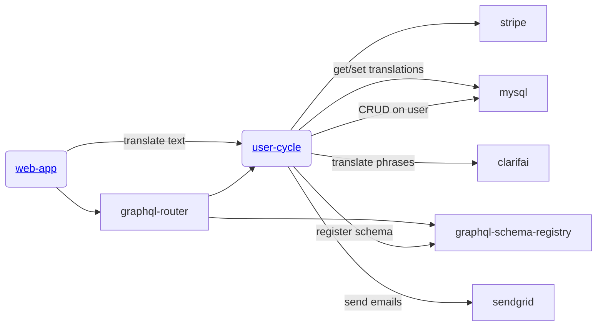

# user-cycle
Gratheon.com user data related service, responsible for:
- registration & login
- billing
- translations of web-app labels (would be good to move to separate service)

## Stripe
- https://stripe.com/docs/billing/subscriptions/build-subscriptions
- https://dashboard.stripe.com/test/webhooks/create?endpoint_location=local

## Architecture



## Development
```
tilt up
```

## Testing
### Payment flow

```
stripe listen --forward-to localhost:4000/webhook
```

Enter 4242 4242 4242 4242 as the card number
Enter any future date for card expiry
Enter any 3-digit number for CVV
Enter any billing postal code (90210)
